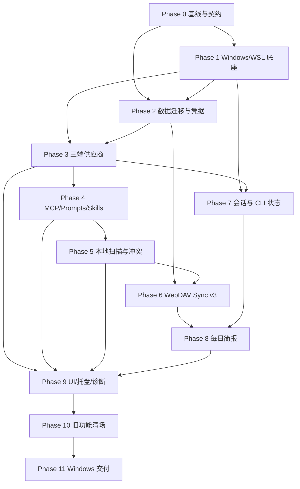

# WSL Code Switch 完整改造规格与实施计划

> 文档状态：需求已确认，实施中  
> 目标项目：`cc-switch` 3.19.2  
> 目标产品：`WSL Code Switch`  
> 编制日期：2026-08-13  
> 最后整理：2026-08-17<br>
> 规格版本：1.1（已确认）<br>
> 适用环境：Windows 11 x64 + WSL2 Ubuntu + Windows Terminal  
> 需求优先级：本文档中的已确认决策高于原项目现有行为  
> 实施进度：以 [`docs/progress/MASTER.md`](../progress/MASTER.md) 为准

## 阅读导航

- 第 0 至 3 节：已确认决策、总体目标、个人维护策略和固定运行环境。
- 第 4 至 6 节：当前架构问题、保留/删除范围和各功能域的目标行为。
- 第 7 至 10 节：本地扫描、迁移安全、WebDAV 双向同步和每日 AI 工作简报。
- 第 11 至 12 节：目标分层架构、必要端口和建议数据模型。
- 第 13 至 15 节：12 个实施阶段、75 项任务、依赖关系和并行边界。
- 第 16 至 21 节：测试矩阵、完成定义、风险、实施纪律、交付物和非目标范围。
- 第 22 节：基于当前仓库搜索得到的代码改造落点索引。

## 0. 已确认需求基线

本节把需求澄清阶段的结论集中固化。下表中的“删除”均指彻底移除对应 UI、命令、服务、依赖、后台任务、持久化活动逻辑、测试和文档入口，而不是仅隐藏界面；“手动同步”均指由用户明确点击触发，不得在后台自动写入本地配置或访问 WebDAV。

| 决策域              | 已确认结论                          | 实施含义                                                                |
| ------------------- | ----------------------------------- | ----------------------------------------------------------------------- |
| 使用对象            | 仅个人使用                          | 不设计多用户、团队、权限、审计或企业管理能力                            |
| 上游维护            | 只挑选关键修复                      | 只回迁三端兼容、Windows/WSL、数据安全、安全漏洞和构建阻断修复           |
| 宿主平台            | Windows 11 x64 原生运行             | Tauri 后端、安装、凭据和系统集成均以 Windows 为唯一宿主                 |
| WSL 环境            | 固定 WSL2 `Ubuntu`、用户 `zhldm`    | 不提供发行版、用户或配置根目录选择器                                    |
| 客户端              | 仅 Claude Code、Codex、OpenCode     | 删除其他客户端的模型、适配器、入口、资源和测试                          |
| 供应商              | 仅官方和自定义（按客户端实际能力）  | Claude/Codex 保留官方入口；三端自定义供应商均须使用 CLI 原生直连协议    |
| 供应商能力          | 保留核心 CRUD、切换、额度和必要检测 | 不借机恢复代理、协议转换、测速平台或统计链路                            |
| 代理                | 删除                                | 删除转发、路由接管、托管 OAuth、Copilot、故障转移和队列                 |
| 统计                | 删除                                | 删除用量、成本、价格、趋势、请求日志和统计仪表盘                        |
| Profiles            | 删除                                | 删除 Profiles 的前后端、数据活动逻辑和导入导出能力                      |
| MCP                 | 保留核心管理                        | 增加三端 live 配置扫描，以及经用户确认的双向本地同步                    |
| Prompts             | 保留精简核心                        | 三端独立版本，Claude 使用 `CLAUDE.md`，Codex/OpenCode 使用 `AGENTS.md`  |
| Skills              | 保留本地核心                        | 保留三端复制、外改扫描、导入和手动本地同步；删除在线仓库、安装和升级    |
| 通用片段            | 保留                                | Claude/Codex 分离，排除凭据、MCP、Prompt、Skill 和供应商专属字段        |
| 会话                | 保留只读核心                        | 只浏览、搜索、查看和恢复；不得编辑、删除、迁移或上传原始会话            |
| CLI 状态            | 保留                                | 查询当前版本和官方最新稳定版，生成可复制的安装/升级命令，应用不执行命令 |
| 本地配置感知        | 保留并增强                          | 软件外部修改后可以扫描显示；周期任务只检测变化，不自动覆盖任一侧        |
| 云同步              | WebDAV 多设备双向同步               | 逐记录三方合并、ETag 条件写、设备登记、墓碑和端到端加密                 |
| 云同步触发          | 仅手动                              | 不定时访问 WebDAV、不后台重试、不自动上传或下载                         |
| 设备设置            | 每设备单独固定                      | 当前供应商、路径、设备 ID、凭据、简报模型和运行状态不跨设备同步         |
| 原始会话上云        | 禁止                                | 原始会话、恢复命令和会话索引永不进入同步载荷                            |
| 本地快照            | 删除常规快照                        | 不提供长期、每日或手工快照；仅在高风险写入期间使用临时加密回滚点        |
| 每日工作简报        | 保留并新增                          | AI 汇总三端前一北京时间自然日的全部有效会话                             |
| 简报时间            | 每天北京时间 08:00                  | 源会话连续 5 分钟无变化后生成；错过时按规则补生成                       |
| 简报输出            | 独立离线 HTML                       | 单独存入 `daily-briefs` 文件夹；完整版本可加密同步到 WebDAV             |
| 简报隐私            | 本机先脱敏，模型无工具              | 原始会话不上云；不完整、篡改或待继续的简报不上云                        |
| 托盘                | 保留精简版                          | 只保留打开窗口、三端供应商切换和退出                                    |
| 桌面基础能力        | 保留                                | 保留主题、开机自启、静默启动和精简诊断                                  |
| Deep Link / Updater | 删除                                | 不保留协议注册和应用内自动更新；CLI 升级也只生成复制命令                |
| S3 / 跨平台打包     | 删除                                | 不支持 S3、macOS、Linux 桌面、Windows ARM 或安装包；仅交付便携 EXE      |

### 0.1 需求优先级和变更规则

1. 本节和第 3 节的硬约束优先于上游项目行为、旧数据结构和旧 UI。
2. 第 5 至第 10 节定义功能与安全语义，第 13 节只负责把这些语义拆成实施任务；不能通过修改任务来缩减功能目标。
3. `docs/progress/MASTER.md` 只记录完成度和验证证据，不得反向改变本规格。
4. 实施中若发现未覆盖情形，默认选择不扩大平台、不上传更多数据、不自动覆盖配置和不恢复已删除功能的方案。
5. 任何涉及新增同步数据、扩大文件访问范围、恢复后台网络活动或改变凭据边界的需求，都必须先修改本规格并重新确认。

### 0.2 四种本地与云端数据流必须区分

| 名称               | 数据流                                  | 触发方式                             | 是否联网 |
| ------------------ | --------------------------------------- | ------------------------------------ | -------- |
| 本地扫描           | WSL live 配置 -> 差异/冲突预览          | 启动、恢复、进入页面或前后台摘要轮询 | 否       |
| Skill 本地索引刷新 | 固定 WSL Skill 根 -> managed 数据库索引 | 用户点击 Skill“导入已有”             | 否       |
| 本地手动同步       | 应用数据库 <-> WSL live 配置            | 用户在对应功能页明确确认             | 否       |
| WebDAV 手动同步    | 本机可移植记录 <-> WebDAV 密文记录      | 用户点击“立即同步”                   | 是       |

启动、恢复、进入页面和前后台周期触发的扫描本身永远只读。检测到确定性外部变化时可以更新内存预览和待处理状态，但不得自动写回应用数据库或 WSL live 配置；检测到不确定匹配时必须进入冲突中心。用户点击 Skill“导入已有”本身就是一次单独、显式的本地索引刷新授权，可以按第 6.4 节和第 7.3 节更新 managed 数据库索引，但仍不得写入或覆盖 WSL。

## 1. 文档目的

本文档是 `cc-switch` 裁剪和改造为 `WSL Code Switch` 的权威实施规格，覆盖：

- 产品边界和运行环境。
- 保留、改写和彻底删除的功能。
- 固定 WSL 配置目录和文件访问规则。
- 本地配置扫描、同步和冲突处理。
- WebDAV 多设备双向同步及端到端加密。
- Claude Code、Codex、OpenCode 会话的只读管理。
- 每日 AI 工作简报的完整行为。
- 数据迁移、安全边界、异常处理和回滚策略。
- 分阶段实施任务、依赖关系、测试矩阵和验收标准。

本文档定义完整目标和验收边界，不代表代码改造已经完成。各任务的实际状态、验证证据和下一步以进度跟踪文档为准；规格变更必须先更新本文档，再调整实施任务。

## 2. 总体目标

将当前面向多平台、多客户端、代理转发和用量统计的综合应用，改造为仅供个人使用的 Windows 原生桌面工具，专门管理固定 WSL Ubuntu 环境中的：

- Claude Code
- Codex
- OpenCode

最终产品只保留以下主线能力：

1. 三个 CLI 的供应商配置和切换。
2. MCP、Prompts、Skills 的本地管理和外部改动同步。
3. 本地会话的只读浏览、搜索、查看和恢复。
4. 当前版本、最新版本及可复制升级命令。
5. WebDAV 多设备、逐记录、端到端加密的手动双向同步。
6. 每天北京时间 08:00 自动生成前一自然日的 AI 工作简报。
7. 精简托盘、主题、开机自启、静默启动和诊断。

### 2.1 个人维护策略

- 产品仅供个人使用，不以通用发行版或社区兼容为目标。
- 改造完成后不持续合并上游，也不追求与上游功能对等。
- 只挑选与以下事项直接相关的上游关键修复：
  - Claude Code、Codex、OpenCode 配置格式兼容。
  - Windows 11、WSL2、Windows Terminal 兼容。
  - 数据损坏、迁移失败或配置丢失。
  - 凭据泄露、路径越界、命令注入和同步覆盖等安全问题。
  - Tauri、Rust、React 依赖升级后导致的构建或运行阻断。
- 不回迁上游新增的代理、统计、Profiles、跨平台、其他客户端或商业入口。
- 挑选上游修复前必须先评估是否会重新引入已删除模块或扩大目标平台边界。

## 3. 产品硬约束

### 3.1 平台约束

| 项目        | 固定值                   |
| ----------- | ------------------------ |
| 宿主系统    | Windows 11 x64           |
| WSL 版本    | WSL2                     |
| WSL 发行版  | `Ubuntu`                 |
| WSL 用户    | `zhldm`                  |
| 终端        | Windows Terminal         |
| UI 语言     | 简体中文                 |
| 托盘语言    | 简体中文                 |
| 安装架构    | Windows x64              |
| 交付方式    | 单一便携式 EXE，直接运行 |
| 管理员权限  | 不要求                   |
| Windows ARM | 不支持                   |
| macOS       | 不支持                   |
| Linux 桌面  | 不支持                   |

### 3.2 产品标识

| 项目               | 目标值                                        |
| ------------------ | --------------------------------------------- |
| 产品名称           | `WSL Code Switch`                             |
| Tauri identifier   | `com.zhldm.wsl-code-switch`                   |
| Windows 数据根目录 | `%USERPROFILE%\.wsl-code-switch`              |
| 每日简报目录       | `%USERPROFILE%\.wsl-code-switch\daily-briefs` |

### 3.3 固定 WSL 配置根目录

| 客户端      | Windows UNC 根目录                                   | WSL 路径                       |
| ----------- | ---------------------------------------------------- | ------------------------------ |
| Claude Code | `\\wsl.localhost\Ubuntu\home\zhldm\.claude`          | `/home/zhldm/.claude`          |
| Codex       | `\\wsl.localhost\Ubuntu\home\zhldm\.codex`           | `/home/zhldm/.codex`           |
| OpenCode    | `\\wsl.localhost\Ubuntu\home\zhldm\.config\opencode` | `/home/zhldm/.config/opencode` |

当前供应商、固定路径、设备 ID、WebDAV 凭据、简报模型配置和运行状态均为设备级数据，不跨设备同步。

固定根目录之外仅允许以下明确列出的访问，不得据此开放任意 WSL home 路径：

- Claude Code 初次确认状态文件：`\\wsl.localhost\Ubuntu\home\zhldm\.claude.json`，仅用于既定的初次确认开关。
- OpenCode 只读会话数据根目录：`\\wsl.localhost\Ubuntu\home\zhldm\.local\share\opencode`，仅允许会话扫描和只读 SQLite/JSON 访问，不允许配置写入。

## 4. 当前架构基线

### 4.1 技术栈

- 桌面框架：Tauri 2。
- 后端：Rust。
- 前端：React 18 + TypeScript + Vite。
- 前端数据层：TanStack Query。
- 本地数据库：SQLite + `rusqlite`。
- 样式与组件：Tailwind CSS、Radix UI。
- 当前构建入口：`package.json`、`src-tauri/Cargo.toml`、`src-tauri/tauri.conf.json`。

### 4.2 当前主要调用链

```text
React UI
  -> src/lib/api 与 src/lib/query
  -> Tauri invoke
  -> src-tauri/src/commands
  -> src-tauri/src/services
  -> live 配置适配器 / database DAO / 文件系统 / HTTP
```

### 4.3 已识别的关键耦合

1. `src/App.tsx` 集中承担导航、平台分支、代理状态和多个功能域装配。
2. `src-tauri/src/lib.rs` 同时处理启动、命令注册、Deep Link、Updater、托盘和后台任务。
3. `AppType` 包含八个客户端，并扩散到配置、数据库、托盘、服务和测试。
4. `AppState` 强绑定代理和用量缓存。
5. 当前 WebDAV 同步上传 `db.sql + skills.zip`，属于整包覆盖，不满足逐记录合并。
6. 当前 WebDAV 密码仍属于设置对象，目标要求迁入 Windows 凭据管理器。
7. 当前会话恢复器主要面向 macOS，必须替换为 Windows Terminal + WSL。
8. OpenCode 的部分路径仍按宿主系统用户目录或 XDG 推导，不能直接用于固定 WSL。

### 4.4 S.U.P.E.R 架构健康基线

| 原则          | 当前评分 | 主要问题                               | 改造目标                              |
| ------------- | -------: | -------------------------------------- | ------------------------------------- |
| S：单一职责   |    1.5/5 | 入口和服务模块职责过多                 | 每个领域拆分核心、端口和适配器        |
| U：单向数据流 |      2/5 | UI、状态、后台任务和 live 写入交叉调用 | 固定为扫描、解析、决策、写入流水线    |
| P：端口优先   |    1.5/5 | 多数边界依赖具体文件和具体平台         | 先定义可序列化领域契约                |
| E：环境隔离   |      2/5 | 路径与平台判断散布全库                 | 环境事实集中到单一 Windows/WSL 适配器 |
| R：可替换部件 |    1.5/5 | 删除客户端或代理会产生级联修改         | 通过领域端口隔离各客户端适配器        |

总体评分约为 `1.7/5`。改造必须优先建立新边界，不能只隐藏旧界面。

## 5. 功能范围总表

### 5.1 保留并改写

| 功能域       | 目标范围                                                 |
| ------------ | -------------------------------------------------------- |
| 供应商       | Claude Code、Codex、OpenCode；仅官方和自定义             |
| 额度         | 余额、官方订阅额度、自定义查询脚本、自动刷新             |
| MCP          | 核心管理、本地扫描、手动同步 live 配置、冲突中心         |
| Prompts      | Claude 使用 `CLAUDE.md`；Codex/OpenCode 使用 `AGENTS.md` |
| Skills       | 本地核心管理、三端复制、外部改动感知和手动同步           |
| 通用配置片段 | Claude、Codex 各自独立；编辑、提取、按供应商启用         |
| 会话         | 只读浏览、搜索、查看、Windows Terminal 恢复              |
| CLI 状态     | 当前版本、最新版本、安装/升级命令生成和复制              |
| WebDAV       | 手动、多设备、双向、逐记录、端到端加密同步               |
| 每日简报     | 三端会话汇总、AI 总结、离线 HTML、加密云同步             |
| 桌面壳       | 主题、托盘、自启、静默启动、精简诊断                     |

### 5.2 彻底删除

以下功能必须删除 UI、前端 API、Hooks、查询、Tauri Commands、服务、数据库活动逻辑、依赖、测试、文档入口和构建配置，不接受仅隐藏入口：

- 本地代理服务。
- 路由接管。
- 协议转换。
- 托管 OAuth。
- Copilot。
- 故障转移及队列。
- 代理统计和请求日志。
- 用量/成本仪表盘。
- 会话用量导入。
- 价格表、趋势、请求明细。
- Profiles 全部能力。
- Deep Link 和 `ccswitch://`。
- 应用自身自动更新。
- 应用内安装或执行升级三个 CLI。
- OMO 和 OMO Slim。
- Codex 统一会话历史、迁移、备份账本和还原。
- S3 同步。
- SQL 整库导入/导出。
- 长期、每日和手工快照管理。
- 多端点测速、测速历史和自动批量连通性检测。
- 认证中心。
- CLI 安装冲突扫描。
- GitHub、官网、发布说明、赞助、反馈入口。
- 应用显示选择器。
- 自绘窗口控件。
- macOS、Linux 桌面、Windows ARM 和 MSI/MSIX/NSIS 安装包支持。
- Gemini CLI、Grok Build、OpenClaw、Hermes、Claude Desktop 等非目标客户端。

## 6. 详细功能规格

### 6.1 供应商管理

#### 6.1.1 支持范围

- 支持 Claude Code、Codex、OpenCode。
- Claude Code：保留官方供应商和用户创建的自定义供应商，使用切换语义。
- Codex：保留官方供应商和用户创建的自定义供应商，使用切换语义。
- OpenCode：只管理用户创建或从 live 配置导入的原生 additive provider；不制造没有真实配置语义的“官方供应商”种子。
- OpenCode 自带但未显式写入用户配置的 provider 不映射为应用内供应商记录，也不由应用删除或覆盖。
- 自定义供应商必须是对应客户端可直接连接的原生协议。
- 不提供本地代理、协议转换或路由层兼容。

#### 6.1.2 核心操作

- 新增、编辑、复制、排序、删除自定义供应商。
- 切换当前供应商。
- 从 WSL live 配置扫描和识别供应商。
- 对无法确定归属的 live 配置创建冲突，不自动覆盖。
- 保留供应商说明、图标和必要元数据，但清除广告、合作伙伴和外链资产。

#### 6.1.3 额度和查询

- 保留供应商余额查询。
- 保留官方订阅额度查询。
- 保留自定义查询脚本。
- 保留自动刷新。
- 额度功能不得重新引入代理统计、请求日志、价格表或成本仪表盘。

#### 6.1.4 自定义供应商检测

- 提供手动 Base URL 可达性检测。
- 提供兼容 `/models` 的模型列表获取。
- 不执行多端点测速。
- 不保留测速历史。
- 不自动批量检测全部供应商。

#### 6.1.5 Claude Code 特殊规则

- Claude Remote WSL 扩展联动只修改 WSL 中的 `.claude/config.json`。
- 自定义供应商写入：

```json
{
  "primaryApiKey": "any"
}
```

- 切回官方供应商时移除 `primaryApiKey`。
- 保留“跳过 Claude Code 初次确认”，修改 WSL 中的 `.claude.json`。

#### 6.1.6 Codex 特殊规则

- 切换自定义供应商时固定保留官方 `auth.json` 登录材料。
- 不执行 Codex 会话统一历史迁移。
- 官方认证信息不得写入供应商同步记录或 WebDAV。

#### 6.1.7 通用配置片段

- Claude 和 Codex 分别维护独立片段。
- 支持编辑片段。
- 支持从 live 配置提取。
- 支持按供应商启用。
- 片段必须排除：
  - 凭据。
  - MCP。
  - Prompt。
  - Skill。
  - 供应商专属字段。

### 6.2 MCP 管理

- 保留统一 MCP CRUD。
- 仅保留 Claude Code、Codex、OpenCode 三端启用状态。
- 支持从三个 live 配置扫描。
- 支持手动把应用内状态同步到 live 配置。
- 支持手动把 live 配置变化同步回应用。
- 启动、窗口恢复、进入 MCP 页面时立即扫描。
- 不确定匹配进入统一冲突中心。
- 写入前保留原文件未知字段和客户端专属结构。

### 6.3 Prompts 管理

| 客户端      | live 文件   | 版本策略               |
| ----------- | ----------- | ---------------------- |
| Claude Code | `CLAUDE.md` | 独立多版本，最多 20 个 |
| Codex       | `AGENTS.md` | 独立多版本，最多 20 个 |
| OpenCode    | `AGENTS.md` | 独立多版本，最多 20 个 |

规则：

- 三端版本相互独立。
- 支持创建、编辑、删除、启用和切换版本。
- 超过 20 个版本时禁止新增，除非先删除旧版本。
- 支持从 live 文件提取为新版本。
- 支持手动同步到 live 文件。
- 外部修改只产生变化提示或冲突，不自动覆盖应用内版本。

### 6.4 Skills 管理

- 保留本地 Skill 核心管理。
- 支持 Claude Code、Codex、OpenCode 三端复制同步。
- 固定扫描以下三个 WSL Skill 根，不接受任意 Agent、发行版、用户或路径：
  - Claude Code：`/home/zhldm/.claude/skills`。
  - Codex：`/home/zhldm/.codex/skills`。
  - OpenCode：`/home/zhldm/.config/opencode/skills`。
- 启动、恢复、进入页面和前后台周期扫描只读取数据库已知目录，未知目录只能在用户点击“导入已有”后枚举和展示。
- 用户点击“导入已有”即显式授权一次“本地磁盘驱动索引刷新”：先安全扫描三个固定根并刷新 managed 列表，再展示 unmanaged 候选；打开 Skill 页面本身不构成该授权。
- managed 记录按精确目录名识别，不按内容、名称或描述猜测身份：
  - 某一端目录确认删除时关闭该端；三端目录均确认删除时从 managed 索引移除。
  - 至少一个安全有效副本存在且所有现存副本内容一致时，以现存副本刷新 `name`、`description`、内容哈希、总大小、文件数、WebDAV 云同步资格和三端 `apps` 状态。
  - 多个安全有效副本内容分叉时，保留数据库中的 canonical `name`、`description`、内容哈希、大小、文件数和云同步资格，只按已安全确认存在的副本刷新 `apps`，并显示冲突；不得选择任一副本覆盖其他副本。
  - 目录重命名不推断为同一 Skill：旧目录按删除处理，新目录仅作为 unmanaged 候选出现。
- WSL home 或任一固定根不可用时，必须在索引写入前失败关闭；link/reparse、大小写别名碰撞、无法安全解析或内容/manifest 无效的副本不得触发对应 managed 记录的删除、改名或错误关闭。
- 索引刷新计划中的 upsert 和删除必须在单个 SQLite transaction 中提交；只有计划确实修改 managed 索引时才创建最多 3 个 DPAPI 加密临时回滚点，提交并校验成功后立即删除。无变化的纯扫描不得创建回滚点。
- background Skill scan 只扫描数据库已知目录；fresh process 首轮必须以 `core_skills` 中已确认的内容哈希和 `apps` 状态为基线，检测应用停机期间的修改、删除或已知目录新增。无已确认哈希的记录必须强制解析，不得把首轮当前值静默当作基线。
- 支持外部改动感知和经用户确认的手动同步；扫描、索引刷新和冲突展示均不得写入或覆盖 WSL。
- 删除在线仓库发现、安装和升级能力。
- 不跟随符号链接。
- 解析后的实际路径不得越出固定配置根目录。
- 不引入任意 Agent/路径选择、`.disabled` 目录约定或自动覆盖。该行为只借鉴 SkillManage“本地磁盘驱动索引刷新”的理念，并保留本产品的固定 WSL 边界、精确目录身份和冲突保护。

限制：

| 限制项            |   上限 |
| ----------------- | -----: |
| 单个 Skill 总大小 |  20 MB |
| 单个 Skill 文件数 |    500 |
| 单文件大小        |  10 MB |
| Skills 云同步总量 | 200 MB |

超限 Skill 仍可在本地使用，但不得上传 WebDAV。扫描时忽略：

- `.git`
- `node_modules`
- 缓存目录
- 构建产物

### 6.5 会话管理

#### 6.5.1 只读边界

- 只允许浏览、搜索和查看会话。
- 禁止删除、编辑、迁移、合并或改写原始会话。
- 原始会话、目录、恢复命令和搜索索引均不上传 WebDAV。
- 原始会话删除后保留已有简报，只把本机来源状态标记为不存在。

#### 6.5.2 支持来源

- Claude Code JSONL 会话。
- Codex sessions、archived sessions、索引和只读状态数据库。
- OpenCode JSON storage 和只读 SQLite 会话数据库。

#### 6.5.3 恢复方式

- 通过 Windows Terminal 恢复。
- 固定使用 `wsl.exe -d Ubuntu -u zhldm`。
- 使用进程参数数组构造命令，不拼接未经转义的 shell 字符串。
- 恢复时传入对应 WSL 工作目录和原生 CLI resume 参数。

### 6.6 CLI 状态页

- 显示应用当前版本。
- 不查询应用自身最新版本。
- 检测 WSL 中 Claude Code、Codex、OpenCode 的当前版本。
- 联网查询三个 CLI 的最新稳定版本。
- 识别实际安装渠道。
- 生成对应升级命令，仅供复制，不执行。
- 同时提供：
  - 可在 WSL 内执行的命令。
  - 可在 PowerShell 中调用 WSL 的包装命令。
- 未安装时提供官方安装命令。
- 最新版本来源和安装命令需要通过官方发布源验证。

### 6.7 桌面壳与设置

- 主题保留浅色、深色、跟随系统。
- 托盘固定启用。
- 关闭主窗口固定隐藏到托盘。
- 保留开机自启开关。
- 保留静默启动开关。
- 托盘只保留：
  - 打开主窗口。
  - Claude Code 供应商切换。
  - Codex 供应商切换。
  - OpenCode 供应商切换。
  - 退出。
- 删除应用选择器和自绘窗口控件。

### 6.8 精简诊断

- 日志级别固定为 `info`。
- 使用滚动日志，限制磁盘占用。
- 提供“打开日志目录”。
- 提供“复制脱敏诊断报告”。
- 诊断报告不得包含 API Key、令牌、密码、Cookie、私钥、同步口令或完整会话正文。

## 7. 本地扫描与冲突处理规格

### 7.1 扫描触发

| 场景                       | 行为                                                           | 是否允许写数据库/WSL  |
| -------------------------- | -------------------------------------------------------------- | --------------------- |
| 应用启动                   | 立即只读扫描全部目标域                                         | 否/否                 |
| 主窗口从托盘恢复           | 立即只读扫描全部目标域                                         | 否/否                 |
| 进入对应页面               | 立即只读扫描该功能域                                           | 否/否                 |
| 应用前台                   | 每 5 秒只读比较摘要                                            | 否/否                 |
| 托盘后台                   | 每 30 秒只读比较摘要                                           | 否/否                 |
| 点击 Skill“导入已有”       | 显式刷新 managed 本地索引，随后展示 unmanaged 候选             | 仅允许事务更新索引/否 |
| 确认本地同步或冲突处理动作 | 按用户选定动作更新数据库或经安全写入管线更新对应 WSL live 配置 | 依动作而定            |

上述启动、恢复、页面和定时行为只执行本地摘要比较，不构成自动同步：没有变化时不得解析完整内容；发现变化时只生成差异或冲突预览，等待用户明确处理。Skill“导入已有”是独立的显式本地索引刷新操作，不得由页面进入、定时器或后台 worker 代替触发。

纳入扫描的功能域：

- 供应商。
- MCP。
- Prompts。
- Skills。

### 7.2 只读检测流水线

```text
固定根目录解析
  -> 安全扫描
  -> 摘要比较
  -> 仅变化时解析
  -> 领域归一化
  -> 与数据库状态比较
  -> 差异或冲突预览
  -> 等待用户明确处理
```

该流水线不持有数据库或 WSL 写入能力。用户后续选择本地同步或冲突动作时，才进入独立的事务/原子写入管线；用户点击 Skill“导入已有”时，改走下节定义的索引刷新管线。

### 7.3 Skill 扫描与显式索引刷新

Skill 必须区分两个互不替代的路径：

1. **background read-only scan**
   - 启动、恢复、进入 Skill 页面、前台 5 秒和托盘后台 30 秒只扫描 `core_skills` 已知目录，不枚举 unknown 目录。
   - fresh process 首轮从 `core_skills.content_hash` 和三端 `apps` 读取已确认基线，再与 WSL 当前摘要比较，必须发现停机期间的已知目录修改、删除和新增副本。
   - 已启用但 `content_hash` 为空的未确认记录首轮必须完整解析；不得因进程内尚无摘要就把当前 WSL 状态当作已确认事实。
   - 结果只进入差异/冲突预览；不得修改 managed 索引、不得导入 unknown、不得写 WSL、不得创建回滚点。

2. **“导入已有”显式刷新**
   - 用户点击后，先完整列出三个固定 Skill 根；任一 WSL home/根不可访问时在任何数据库变更前停止。
   - 对每条 managed 记录按大小写敏感的精确目录名安全捕获现存副本，并按第 6.4 节的删除、一致刷新、内容分叉和异常保护规则形成索引变更计划。
   - link/reparse、越界、大小写别名、重复候选或 invalid copy 只产生受保护问题，不得被解释为目录不存在；无问题的其他记录可以继续刷新。
   - 只有变更计划非空时才创建 DPAPI 临时回滚点，并在一个 SQLite transaction 中提交全部 upsert/delete；校验成功后删除回滚点，失败保留且全局最多 3 份。计划为空时不启动事务性写入、不创建回滚点。
   - managed 列表刷新完成后才读取安全的 unknown manifest 并展示 unmanaged 候选；unknown 在用户进一步确认导入前不得进入数据库，也不得被 background scan 接管。
   - 整个操作不写、不复制、不覆盖 WSL。目录复制与本地同步仍是后续单独、明确确认的动作。

设计来源只取 SkillManage“本地磁盘驱动索引刷新”的理念；实现仍固定为 Claude Code、Codex、OpenCode 三端和既定 WSL 路径，不扩展任意 Agent/目录，不采用 `.disabled` 语义，也不以磁盘版本自动覆盖数据库 canonical 元数据或其他 WSL 副本。

### 7.4 摘要和自写抑制

- 摘要未变化时不得重复解析大文件或 Skill 目录。
- 应用自身写入后记录期望摘要和写入代次。
- 后续扫描命中相同期望摘要时，不生成外部修改事件。
- 自写抑制不得掩盖写入后又被第三方修改的内容。

### 7.5 路径安全

- 不跟随符号链接。
- 对每个候选路径执行规范化和最终路径验证。
- 最终路径必须位于对应固定 WSL 配置根目录内。
- 遇到越界、循环、无法解析或权限异常时停止处理该记录并记录脱敏诊断。
- 文件写入使用 WSL UNC 兼容的原子替换策略。

### 7.6 冲突中心

- 供应商、MCP、Prompts、Skills 和 WebDAV 冲突统一进入冲突中心。
- 无冲突记录可以继续处理，不因单条冲突阻塞整个批次。
- 冲突记录保持原状，不自动选择本地或外部版本。
- 至少显示记录类型、名称、来源、修改时间、摘要差异和可选动作。
- 冲突处理前创建临时 DPAPI 加密回滚点。
- 成功校验后删除回滚点；失败时最多保留 3 份。

## 8. 本地数据、迁移和安全

### 8.1 数据目录迁移

旧目录可能位于 Windows 用户目录中的 `.cc-switch`。新版本首次启动时：

1. 只读识别旧数据库和设置版本。
2. 校验旧数据可读性。
3. 创建临时 DPAPI 加密回滚点。
4. 只迁移目标功能需要的数据。
5. 写入 `%USERPROFILE%\.wsl-code-switch`。
6. 校验数据库、记录数量和关键字段。
7. 成功后删除临时回滚点。
8. 不自动删除旧目录。

首个改造版本不应直接 `DROP` 旧功能表。先停止读取和写入这些表，待新版本稳定后再执行物理清理迁移。

### 8.2 不保留常规快照

不建立长期、每日或手工快照系统，也不提供快照管理页面。只读扫描、摘要比较、版本查询、会话浏览和同步预览均不创建回滚点。

临时回滚点不是备份功能，而是跨 SQLite、设置文件、WSL live 配置和 Windows 凭据管理器执行高风险写入时的短期事务保护。仅在操作确实可能替换或删除现有有效数据时创建：

- 数据迁移。
- Skill“导入已有”导致的实际 managed 索引更新或删除。
- WebDAV 同步。
- 冲突处理。
- 恢复操作。
- 远端重置。

成功且完成完整性校验后立即删除，不向用户积累可管理的历史版本。失败或进程中断时最多保留最新 3 份 DPAPI 加密回滚点，仅供软件自动恢复；回滚成功后删除对应文件。回滚点不得上传 WebDAV，不得包含超出恢复所需范围的数据，也不得替代用户自己的备份。

### 8.3 凭据存储

| 数据              | 存储方式            | 是否上传 |
| ----------------- | ------------------- | -------- |
| WebDAV 密码       | Windows 凭据管理器  | 否       |
| WebDAV 同步口令   | Windows 凭据管理器  | 否       |
| 简报模型 API Key  | Windows 凭据管理器  | 否       |
| 本机敏感字段      | DPAPI               | 否       |
| 官方 CLI 登录令牌 | CLI 自身存储        | 否       |
| WSL live 必要凭据 | 按 CLI 要求保留明文 | 否       |

同步口令错误、认证标签失败或远端数据无法解密时，绝不覆盖远端或本地有效数据。

## 9. WebDAV 多设备双向同步规格

### 9.1 触发策略

- 只允许用户点击“立即同步”。
- 不自动同步。
- 不定时访问 WebDAV。
- 不在后台重试。
- 离线时所有本地功能继续工作。
- 失败后只显示状态，由用户再次手动触发。

### 9.2 同步范围

| 数据域            | 是否同步 | 说明                           |
| ----------------- | -------- | ------------------------------ |
| 供应商记录        | 是       | 排除设备当前选择和官方登录令牌 |
| MCP               | 是       | 逐记录同步                     |
| Prompts           | 是       | 包括独立版本                   |
| Skills            | 是       | 遵守大小与总量限制             |
| 通用配置片段      | 是       | 排除凭据和供应商专属字段       |
| 可移植设置        | 是       | 仅与设备无关的设置             |
| 完整每日简报      | 是       | 作为加密派生对象               |
| 当前供应商        | 否       | 每台设备独立                   |
| 固定 WSL 路径     | 否       | 每台设备独立                   |
| 设备 ID           | 否       | 本机固定身份                   |
| WebDAV 凭据       | 否       | Windows 凭据管理器             |
| 简报模型配置      | 否       | 每台设备独立                   |
| 原始会话          | 否       | 完全不同步                     |
| 会话/简报搜索索引 | 否       | 可在本机重建                   |
| 恢复命令          | 否       | 运行时生成                     |

### 9.3 同步模型

- 使用逐记录三方合并：基线、本地、远端。
- 每条记录具有稳定 ID、领域类型、版本、内容哈希、更新时间和删除状态。
- 当前供应商不属于可移植记录。
- 无冲突记录先完成同步。
- 冲突记录保持两端原状并进入冲突中心。
- 不使用整库 SQL 导入/导出作为同步协议。

### 9.4 乐观并发

1. 读取远端清单和 ETag。
2. 解密并验证远端对象。
3. 执行三方合并。
4. 使用 `If-Match` 条件写远端。
5. 如 ETag 竞争失败，重新拉取并合并一次。
6. 第二次仍竞争失败则停止，不继续覆盖。

### 9.5 删除墓碑

- 删除使用墓碑传播。
- 墓碑默认永久保留。
- 只有确认所有有效设备都已追上对应版本后才允许压缩。
- 提供同步设备列表。
- 提供显式退役设备操作。
- 退役前提示该设备之后重新出现可能造成的影响。

### 9.6 新设备首次加入

- 首次只读预览远端内容。
- 展示将新增、修改、删除和冲突的记录数量。
- 用户确认后才执行首次合并和登记设备。
- 未确认前不得写远端或修改本地可移植数据。

### 9.7 端到端加密

- 使用 Argon2id 从同步口令派生主密钥。
- 内容使用 AES-256-GCM。
- 每个加密对象使用唯一 nonce。
- AAD 至少绑定协议版本、对象类型、记录 ID 和版本。
- 远端只出现密文、必要的非敏感协议元数据和完整性信息。
- 远端不得出现 API Key、官方令牌、原始会话或明文简报。
- 密码学参数必须版本化，以支持未来迁移。

## 10. 每日 AI 工作简报规格

### 10.1 目标

每天汇总 Claude Code、Codex、OpenCode 在前一个北京时间自然日产生的全部有效本地会话，生成一份可离线查看的简体中文 HTML 工作简报。

### 10.2 时间和调度

- 固定使用 `Asia/Shanghai`，不跟随 Windows 系统时区。
- 每天北京时间 `08:00` 汇总前一自然日。
- 生成前要求当天源会话连续 5 分钟无变化。
- 应用未运行时，下次启动补生成。
- 应用在 08:00 休眠时，唤醒后检测漏过任务并等待稳定期。
- 自动补生成最多处理 7 个缺失日期，按从旧到新执行。
- 更早缺口只提示，由用户逐日手动生成。
- 首次启用不自动回溯历史。
- 提供“立即生成”“续跑”“重新生成”。
- 自动生成默认关闭。
- 只有配置自定义供应商和模型、连通性测试成功、完成隐私确认并明确开启后才自动运行。

### 10.3 日期归属

- 始终按消息的北京时间归属日期。
- 跨越北京时间零点的会话按消息拆分到相邻日期。
- 每日只总结该自然日产生的内容，避免整段会话重复。
- 某日无有效会话时不调用 AI、不生成空 HTML，只记录“无会话，无需生成”。
- 后续发现迟到或补写内容时重新标记为可生成。

### 10.4 模型绑定

- 简报设置独立固定选择一个已有的自定义供应商和具体模型。
- 不跟随 Claude、Codex 或 OpenCode 当前供应商切换。
- 不允许使用官方登录令牌。
- 不经过本地代理。
- 不自动故障转移。
- 提供手动连通性测试。
- 供应商或模型删除、失效时暂停生成并明确提示。
- 供应商、模型和 API Key 均为设备级配置，不上传 WebDAV。

### 10.5 隐私确认

- 首次手动或自动生成前，明确提示脱敏后的会话内容仍会发送到自定义 API。
- 提示第三方数据保留策略由服务商决定。
- 确认记录仅保存在本机。
- 更换供应商或 Base URL 后必须重新确认。
- 每次调用使用独立无状态请求，不传服务端会话 ID。
- 协议支持时关闭存储、追踪和训练选项。

### 10.6 输入范围

纳入：

- 用户消息。
- 助手最终回复。
- 关键命令结果。
- 错误信息。
- 代码变更摘要。

排除：

- 系统提示词。
- 工具定义。
- 隐藏思考。
- 原始超长日志。
- 二进制内容。
- 附件正文。
- 代码正文。
- 完整 diff。

子代理会话不单独重复汇总，仅纳入已经返回主会话的结果。

简报可记录仓库、文件路径、变更目的和结果；必要时最多引用少量已脱敏错误片段。

### 10.7 脱敏和提示注入防护

- 在发送给 AI 和写入 HTML 前统一脱敏。
- 至少识别 API Key、令牌、密码、Cookie、私钥和连接串。
- 使用类型占位符，例如 `[API_KEY_REDACTED]`。
- 保留项目名、普通文件路径和代码术语。
- 所有会话内容视为不可信数据。
- 固定系统指令要求忽略会话内改变任务、泄露信息或执行操作的内容。
- 简报模型禁用工具调用、联网和文件访问。
- 模型必须返回受约束的结构化数据。
- 本地执行 Schema 校验、字段长度限制和 HTML 转义。
- 校验失败进入生成失败流程。

### 10.8 分块、限额和重试

| 项目             | 固定规则             |
| ---------------- | -------------------- |
| 分块目标         | 每块约 24,000 tokens |
| 每日 AI 调用上限 | 50 次                |
| 每日累计输入上限 | 约 1,000,000 tokens  |
| 单次请求超时     | 5 分钟               |
| 可重试次数       | 最多 3 次            |

- 先在本地去除重复输出和无意义日志。
- 先分块总结，再进行二次汇总。
- 网络错误、HTTP 408、429 和 5xx 使用带抖动的指数退避。
- 遵守 `Retry-After`。
- 认证失败、余额不足、模型不存在和内容超限不自动重试。
- 达到每日上限时标记“待继续”，不得伪装成完整简报。

### 10.9 并发和检查点

- 全局只运行一个简报生成任务。
- 同一天只允许一个任务。
- 普通任务按日期从旧到新排队。
- 经确认的重新生成任务排在普通缺失任务之前，但不强制中断正在运行任务。
- 用户可取消当前任务。
- 取消或中断时仅在本机保存 DPAPI 加密检查点。
- 检查点最多保留 7 天，不上传 WebDAV。
- 完整生成成功后立即删除所有分块中间摘要和检查点。

### 10.10 输出内容

固定栏目：

1. 每日摘要。
2. 按项目归类的工作内容。
3. 已完成事项。
4. 关键决策。
5. 问题与阻塞。
6. 未完成事项。
7. 次日建议。

三端内容先合并去重。每项仅附：

- 来源工具。
- 北京时间。
- 本地会话 ID。

不嵌入完整原始对话。

### 10.11 HTML 规范

- 固定简体中文。
- 独立单文件 HTML。
- CSS 全部内嵌。
- 不加载 CDN、远程字体、图片或其他外部资源。
- 不执行 JavaScript。
- 所有模型输出必须经过 HTML 转义。
- 文件记录生成日期、生成时间、设备身份、模型名称、模板版本和提示词版本。
- 本地 HTML 为脱敏后的明文文件，依赖 Windows 用户目录访问权限保护。
- 设置页明确提示本地 HTML 为明文。
- 上传 WebDAV 前必须端到端加密。

### 10.12 文件名和设备身份

- 专用目录：`%USERPROFILE%\.wsl-code-switch\daily-briefs`。
- 设备身份使用首次登记后固定不变的设备 ID。
- 文件名格式：`YYYY-MM-DD-设备名-设备ID短码.html`。
- 示例：`2026-08-13-DESKTOP-A1B2C3.html`。
- Windows 设备名称改变时不批量改旧文件。
- 新文件使用新设备名，但仍通过固定设备 ID 判断同一设备。

### 10.13 保存、修改和删除

- 完整简报永久保留，不自动清理。
- 手动删除时删除 HTML 和可重建索引。
- 只保留日期、设备 ID、内容哈希、删除时间等最小墓碑。
- 墓碑不保留标题、摘要或正文。
- 用户可明确重新生成，生成高于墓碑的新版本。
- 重新生成覆盖同一天的本地正式 HTML 前，先创建临时回滚文件；新文件完成结构、哈希和完整性校验后再原子替换并删除回滚文件。
- 源会话在简报完成后变化时，只标记“内容已变化”，不自动调用 AI 或覆盖文件。
- 外部修改 HTML 时标记“完整性异常”，不得上传、不得自动覆盖。
- 用户可保留异常文件副本后重新生成，或删除异常文件。

### 10.14 失败和不完整状态

- 单次任务按规则最多重试 3 次。
- 仍失败时生成明确标记“未完成”的本地 HTML。
- 未完成 HTML 只列出失败会话 ID 和脱敏原因，不包含敏感原文。
- 未完成、待继续、完整性异常的简报不得上传 WebDAV。
- 手动续跑成功后原子替换为完整版本，再允许下一次手动同步。

### 10.15 多设备同步行为

- 每台设备独立生成简报，不跨设备汇总原始会话。
- HTML 是派生数据，可以端到端加密后同步。
- 同一设备、同一天出现两个不同完整版本时不按时间戳覆盖，也不合并 HTML。
- 两个版本都保留并进入冲突中心。
- 冲突中心展示生成时间、内容哈希和来源设备。
- 用户选择正式版本；另一个版本可作为带冲突后缀的副本保留或删除。

新设备首次同步：

- 只保存加密简报对象和索引。
- 不自动批量解密为明文 HTML。
- 云端简报缓存落盘时使用 DPAPI 保护。
- 用户点击“查看”时才短暂解密为受限的明文临时文件。
- 关闭查看后尽快删除明文临时文件，下次启动时清理残留。
- 只有明确“导出”才持久写入 `daily-briefs`。

### 10.16 应用内页面

“每日简报”页面只提供：

- 日期筛选。
- 设备筛选。
- 状态查看。
- 生成、续跑、重新生成。
- 打开 HTML。
- 打开目录。
- 删除。
- 轻量本地全文搜索。

不内置复杂 HTML 预览器。

搜索规则：

- 只索引本机已生成、已导出或已解密查看的简报。
- 索引不上传 WebDAV。
- 索引可以一键重建。
- 仅存在于云端的加密简报不自动解密建索引。

HTML 中不提供“打开会话”链接。应用内只有在本机存在对应原始会话时才启用“打开会话”。

### 10.17 模板管理

- 使用应用内置、带版本号的固定提示词。
- 使用应用内置、带版本号的固定 HTML 模板。
- 不开放任意提示词或模板编辑。
- 只允许配置长度受限并会脱敏的“重点关注内容”。
- 模板或提示词升级不改写历史简报。
- 用户可以按单日手动重新生成。

## 11. 目标架构

### 11.1 分层原则

```text
UI / Tauri Commands
        ↓
Application Use Cases
        ↓
Domain Models and Policies
        ↓
Ports
        ↓
Windows / WSL / SQLite / WebDAV / AI Adapters
```

核心领域不得直接依赖 Tauri、Windows API、具体文件路径或具体 HTTP 客户端。

### 11.2 建议领域模块

```text
src-tauri/src/
  domain/
    app.rs
    provider.rs
    mcp.rs
    prompt.rs
    skill.rs
    conflict.rs
    sync_record.rs
    daily_brief.rs
  ports/
    live_config.rs
    secret_store.rs
    crypto.rs
    sync_transport.rs
    session_source.rs
    ai_summary.rs
    clock.rs
  adapters/
    wsl_paths.rs
    claude/
    codex/
    opencode/
    windows_credentials.rs
    dpapi.rs
    webdav.rs
    sqlite.rs
    windows_terminal.rs
  application/
    scan_and_reconcile.rs
    switch_provider.rs
    manual_sync.rs
    generate_daily_brief.rs
```

具体目录名可按现有代码风格调整，但职责边界不得退化为新的巨型服务。

### 11.3 必要端口

| 端口                | 职责                                     |
| ------------------- | ---------------------------------------- |
| `WslPathResolver`   | 返回固定三端根目录及安全路径验证         |
| `LiveConfigAdapter` | 扫描、解析和原子写入单个客户端 live 配置 |
| `SecretStore`       | Windows 凭据管理器的读写删               |
| `LocalProtector`    | DPAPI 加解密临时回滚点和检查点           |
| `SyncTransport`     | WebDAV GET/HEAD/PUT 和 ETag 条件写       |
| `SyncCrypto`        | Argon2id、AES-GCM 和版本化 envelope      |
| `SessionSource`     | 三端只读会话扫描及归一化事件             |
| `AiSummaryClient`   | 无状态原生 API 调用                      |
| `BriefRenderer`     | 结构化数据到无脚本离线 HTML              |
| `Clock`             | 北京时间边界和可测试调度                 |

## 12. 建议数据模型

最终表名可在实现阶段调整，但必须覆盖以下领域信息：

| 数据域            | 必要内容                                          |
| ----------------- | ------------------------------------------------- |
| providers         | 三端供应商、类型、配置、排序、可移植元数据        |
| mcp_servers       | MCP 记录及三端启用状态                            |
| prompt_versions   | 客户端、名称、内容、版本、启用状态                |
| skills            | Skill 元数据、哈希、三端状态、大小和上传资格      |
| common_snippets   | Claude/Codex 独立片段及供应商关联                 |
| conflicts         | 领域、记录 ID、两侧摘要、状态和处理结果           |
| sync_records      | 记录版本、哈希、基线、墓碑、最后同步代次          |
| sync_devices      | 固定设备 ID、名称、最后确认版本、退役状态         |
| daily_briefs      | 日期、设备 ID、状态、哈希、源指纹、模型和模板版本 |
| brief_checkpoints | 本机加密检查点元数据和过期时间                    |
| settings          | 仅非敏感设置和凭据引用                            |

以下旧表在新核心中不得继续读写：代理配置、代理日志、模型计价、用量汇总、会话用量同步、Profiles 和测速日志。

## 13. 分阶段实施计划

任务规模说明：`S` 约 0.5 到 1 天，`M` 约 1 到 3 天，`L` 约 3 到 7 天，`XL` 需要进一步拆分后实施。估算只用于排序，不是交付承诺。

### Phase 0：冻结基线和契约

**目标**：在大规模删除前建立可验证基线。  
**S.U.P.E.R 重点**：P、U。

| ID    | 任务                                    | 优先级 | 规模 | 依赖  | 验收标准                             |
| ----- | --------------------------------------- | ------ | ---- | ----- | ------------------------------------ |
| P0-01 | 建立 v16 数据库、三端配置和会话测试夹具 | P0     | M    | 无    | 夹具覆盖目标保留数据和主要旧数据形态 |
| P0-02 | 固化三端 live 配置往返测试              | P0     | M    | P0-01 | 解析后写回不丢未知字段               |
| P0-03 | 记录当前前后端测试基线                  | P1     | S    | 无    | 可区分既有失败和改造回归             |
| P0-04 | 定义领域 ID、序列化 schema 和错误类型   | P0     | M    | P0-01 | 关键跨模块对象均有显式契约           |

**阶段门**：夹具和契约合并前，不开始删除旧模块。

### Phase 1：Windows/WSL 平台底座和品牌

**目标**：建立唯一平台事实来源。  
**S.U.P.E.R 重点**：S、E、R。

| ID    | 任务                                    | 优先级 | 规模 | 依赖  | 验收标准                             |
| ----- | --------------------------------------- | ------ | ---- | ----- | ------------------------------------ |
| P1-01 | 实现固定 `WslPathResolver`              | P0     | M    | P0-04 | 三端根目录与子路径均由单一适配器提供 |
| P1-02 | 实现 UNC 安全解析、越界和 symlink 防护  | P0     | L    | P1-01 | 越界、循环和链接测试全部拒绝         |
| P1-03 | 实现 WSL UNC 原子读写适配器             | P0     | M    | P1-01 | Windows 到 WSL2 实机契约测试通过     |
| P1-04 | 更名产品、identifier 和数据目录         | P0     | M    | P1-01 | 应用与可执行文件均显示新名称和新标识 |
| P1-05 | 将构建目标限制为 Windows x64 便携式 EXE | P1     | M    | P1-04 | 不再生成安装包、其他平台或 ARM 产物  |

**阶段门**：固定 WSL 真实路径读写和 Windows x64 打包配置通过。

### Phase 2：精简数据层、迁移和凭据底座

**目标**：安全迁移保留数据，建立敏感信息存储。  
**S.U.P.E.R 重点**：U、P、R。

| ID    | 任务                                  | 优先级 | 规模 | 依赖                | 验收标准                             |
| ----- | ------------------------------------- | ------ | ---- | ------------------- | ------------------------------------ |
| P2-01 | 设计新数据库 schema 和可逆迁移步骤    | P0     | L    | P0-04               | schema 只服务保留域且迁移步骤可测试  |
| P2-02 | 实现旧 `.cc-switch` 只读识别          | P0     | M    | P2-01               | 不修改旧目录即可生成迁移预览         |
| P2-03 | 实现临时 DPAPI 加密回滚点             | P0     | L    | P1-04               | 成功删除、失败最多保留 3 份          |
| P2-04 | 实现 Windows 凭据管理器 `SecretStore` | P0     | L    | P1-04               | WebDAV 和简报密钥不进入设置文件      |
| P2-05 | 实现保留数据迁移及完整性校验          | P0     | L    | P2-02、P2-03、P2-04 | v16 样本迁移不丢目标记录，失败可恢复 |
| P2-06 | 停止旧表活动读写，暂缓物理 DROP       | P1     | M    | P2-05               | 新核心运行不访问被删除功能表         |

**阶段门**：迁移成功、迁移失败、磁盘异常和回滚路径全部通过。

### Phase 3：三端供应商核心

**目标**：完成 Claude、Codex、OpenCode 原生直连供应商管理。  
**S.U.P.E.R 重点**：S、P、R。

| ID    | 任务                            | 优先级 | 规模 | 依赖         | 验收标准                                       |
| ----- | ------------------------------- | ------ | ---- | ------------ | ---------------------------------------------- |
| P3-01 | 将应用能力模型收敛为三端        | P0     | L    | P2-01        | 核心枚举不再包含非目标客户端                   |
| P3-02 | 拆分三端 live 配置适配器        | P0     | XL   | P1-03、P3-01 | 各适配器可独立执行往返测试                     |
| P3-03 | 实现三端原生供应商 CRUD/生效    | P0     | L    | P3-02        | Claude/Codex 切换及 OpenCode additive 写入通过 |
| P3-04 | 落实 Claude 特殊写入规则        | P0     | M    | P3-02        | `primaryApiKey` 与 `.claude.json` 行为正确     |
| P3-05 | 落实 Codex `auth.json` 保留规则 | P0     | M    | P3-02        | 自定义供应商切换不破坏官方登录                 |
| P3-06 | 保留余额、订阅额度和自定义脚本  | P1     | L    | P3-03        | 无代理统计依赖且刷新行为正确                   |
| P3-07 | 实现手动连通性和 `/models` 获取 | P1     | M    | P3-03        | 只检测当前选择目标，不形成测速系统             |
| P3-08 | 实现 Claude/Codex 通用配置片段  | P1     | L    | P3-02        | 提取和写入会排除所有禁止字段                   |

**阶段门**：Claude/Codex 完成官方与自定义供应商往返切换；OpenCode 完成自定义 additive provider 的导入、写入和删除往返，且不生成伪官方记录。

### Phase 4：MCP、Prompts 和 Skills

**目标**：完成三个本地配置资源域。  
**S.U.P.E.R 重点**：S、U、P。

| ID    | 任务                                | 优先级 | 规模 | 依赖         | 验收标准                             |
| ----- | ----------------------------------- | ------ | ---- | ------------ | ------------------------------------ |
| P4-01 | 精简 MCP 模型和三端适配器           | P0     | L    | P3-01、P3-02 | CRUD、启用和 live 写回通过           |
| P4-02 | 重构 Prompt 为三端独立版本库        | P0     | L    | P3-01        | `CLAUDE.md`/`AGENTS.md` 最多 20 版本 |
| P4-03 | 精简 Skill 本地核心和三端复制       | P0     | XL   | P1-02、P3-01 | 不依赖仓库安装和更新逻辑             |
| P4-04 | 实现 Skill 限额和忽略规则           | P0     | M    | P4-03        | 所有大小、文件数、总量边界有测试     |
| P4-05 | 删除在线 Skill 仓库、安装和升级入口 | P1     | M    | P4-03        | 前后端无残留调用                     |

**阶段门**：三类资源均能从应用写到 WSL，并能保留客户端未知字段。

### Phase 5：本地扫描和冲突中心

**目标**：感知软件外部修改且不误覆盖。  
**S.U.P.E.R 重点**：U、P、R。

| ID    | 任务                                 | 优先级 | 规模 | 依赖                | 验收标准                                       |
| ----- | ------------------------------------ | ------ | ---- | ------------------- | ---------------------------------------------- |
| P5-01 | 定义统一扫描摘要和变化事件           | P0     | M    | P4-01、P4-02、P4-03 | 四个领域共享契约而不共享具体解析器             |
| P5-02 | 实现启动、恢复、页面、5 秒/30 秒调度 | P0     | M    | P5-01               | 周期符合规格且可取消；Skill 只扫 DB-known 目录 |
| P5-03 | 实现变化后解析和自写抑制             | P0     | L    | P5-01               | 自写不循环，后续第三方改动不被吞掉             |
| P5-04 | 实现本地差异、冲突与 Skill 索引刷新  | P0     | L    | P5-03               | 只读触发零写；显式刷新遵守事务、回滚与冲突保护 |
| P5-05 | 实现统一冲突中心 UI 和处理流程       | P0     | L    | P5-04、P2-03        | 无冲突记录继续，冲突记录保持原状               |

**阶段门**：外部编辑四类配置后，应用能稳定发现、展示并安全处理；Skill background scan 不枚举 unknown，“导入已有”刷新 managed 索引且不写 WSL，并通过事务、DPAPI 回滚、停机变化、重命名和异常路径合同。

### Phase 6：WebDAV Sync v3

**目标**：实现安全、手动、逐记录、多设备双向同步。  
**S.U.P.E.R 重点**：P、U、R。

| ID    | 任务                                       | 优先级 | 规模 | 依赖         | 验收标准                        |
| ----- | ------------------------------------------ | ------ | ---- | ------------ | ------------------------------- |
| P6-01 | 定义 sync-v3 记录、清单、设备和墓碑 schema | P0     | L    | P2-01、P5-04 | schema 可版本化且排除设备级数据 |
| P6-02 | 实现 Argon2id + AES-256-GCM envelope       | P0     | L    | P2-04、P6-01 | KAT、篡改、错误口令测试通过     |
| P6-03 | 精简 WebDAV 传输层并支持 ETag/`If-Match`   | P0     | L    | P6-01        | 条件写和 HTTP 错误映射可靠      |
| P6-04 | 实现逐记录三方合并                         | P0     | XL   | P6-01        | 新增、修改、删除和并发矩阵通过  |
| P6-05 | 实现设备登记、首次预览和退役               | P0     | L    | P6-04        | 未确认首次同步零写入            |
| P6-06 | 实现永久墓碑与安全压缩条件                 | P0     | M    | P6-05        | 未追平设备存在时禁止压缩        |
| P6-07 | 实现一次 CAS 重合并和失败停止              | P0     | M    | P6-03、P6-04 | 第二次竞争时零覆盖停止          |
| P6-08 | 接入冲突中心和临时回滚点                   | P0     | L    | P5-05、P6-04 | 冲突不阻塞无冲突记录            |
| P6-09 | 删除 WebDAV 自动同步和 S3                  | P0     | M    | P6-08        | 无定时网络访问和后台重试        |

**阶段门**：双设备和三设备集成测试、错误口令零写入、远端无明文全部通过。

### Phase 7：只读会话和 CLI 状态

**目标**：建立每日简报可依赖的三端只读会话端口。  
**S.U.P.E.R 重点**：S、P、R。

| ID    | 任务                             | 优先级 | 规模 | 依赖         | 验收标准                       |
| ----- | -------------------------------- | ------ | ---- | ------------ | ------------------------------ |
| P7-01 | 收敛三端 `SessionSource`         | P0     | L    | P1-03、P3-01 | 统一输出可序列化归一化事件     |
| P7-02 | 删除会话写入、删除和迁移命令     | P0     | M    | P7-01        | 后端命令面只有读取和恢复       |
| P7-03 | 实现本地会话搜索和只读详情       | P1     | L    | P7-01        | 索引可重建且不上传             |
| P7-04 | 实现 Windows Terminal + WSL 恢复 | P0     | L    | P7-01        | 参数数组安全，三端恢复命令通过 |
| P7-05 | 实现三端版本和安装渠道检测       | P1     | L    | P1-03        | 当前版本结果可解释             |
| P7-06 | 查询最新版本并生成复制命令       | P1     | L    | P7-05        | 命令来源为官方渠道，应用不执行 |

**阶段门**：三端会话只读测试和 Windows Terminal 实机恢复通过。

### Phase 8：每日 AI 工作简报

**目标**：完整实现第 10 节规格。  
**S.U.P.E.R 重点**：S、U、P、R。

| ID    | 任务                               | 优先级 | 规模 | 依赖         | 验收标准                          |
| ----- | ---------------------------------- | ------ | ---- | ------------ | --------------------------------- |
| P8-01 | 实现北京时间日期切分和任务调度核心 | P0     | L    | P7-01        | 08:00、休眠、补跑、跨零点测试通过 |
| P8-02 | 实现会话筛选、去重和源指纹         | P0     | L    | P7-01        | 只纳入允许内容且可检测迟到变化    |
| P8-03 | 实现脱敏和提示注入防护             | P0     | L    | P8-02        | 敏感夹具不进入 API 请求或 HTML    |
| P8-04 | 实现无状态 `AiSummaryClient`       | P0     | L    | P2-04、P3-03 | 不使用官方令牌、代理或回退        |
| P8-05 | 实现分块、限额、超时和重试         | P0     | L    | P8-04        | 24k/50 次/100 万/300 秒规则准确   |
| P8-06 | 实现 DPAPI 加密续跑检查点          | P0     | M    | P2-03、P8-05 | 7 天过期、成功即删除、不上传      |
| P8-07 | 实现结构校验和离线 HTML 渲染       | P0     | L    | P8-03、P8-05 | 无 JS/外链，输出完全转义          |
| P8-08 | 实现文件完整性、状态和删除墓碑     | P0     | L    | P8-07        | 异常和不完整版本禁止上传          |
| P8-09 | 实现简报页面和轻量本地搜索         | P1     | L    | P8-08        | 完成所有规定操作且无复杂预览器    |
| P8-10 | 将完整简报接入 sync-v3             | P0     | L    | P6-08、P8-08 | 云端仅密文，新设备按需解密        |

**阶段门**：隐私、限额、注入、失败、补跑、多设备冲突和 HTML 安全测试全部通过。

### Phase 9：界面、托盘和诊断收口

**目标**：只暴露目标工作流。  
**S.U.P.E.R 重点**：S、U。

| ID    | 任务                             | 优先级 | 规模 | 依赖       | 验收标准                       |
| ----- | -------------------------------- | ------ | ---- | ---------- | ------------------------------ |
| P9-01 | 重组主导航和三端供应商页面       | P0     | L    | P3、P4、P5 | 不出现非目标客户端和旧功能入口 |
| P9-02 | 重写精简托盘                     | P0     | L    | P3-03      | 只有打开、三端切换和退出       |
| P9-03 | 固定简体中文并精简 i18n          | P1     | M    | P9-01      | 不再加载英/日/繁中资源         |
| P9-04 | 保留主题、自启和静默启动         | P1     | M    | P1-04      | 设置和启动行为符合规格         |
| P9-05 | 实现滚动 info 日志和脱敏诊断报告 | P1     | M    | P2-04      | 报告敏感信息扫描为零           |

**阶段门**：核心工作流从 UI 到 WSL 端到端完成，关闭窗口稳定进入托盘。

### Phase 10：旧功能彻底清场

**目标**：删除运行时、编译时和文档层面的旧能力。  
**S.U.P.E.R 重点**：S、R。

| ID     | 任务                                    | 优先级 | 规模 | 依赖             | 验收标准                             |
| ------ | --------------------------------------- | ------ | ---- | ---------------- | ------------------------------------ |
| P10-01 | 删除代理、路由、OAuth、故障转移及统计   | P0     | XL   | P9-01            | 代码、命令、依赖、表活动逻辑全部消失 |
| P10-02 | 删除 Profiles、Deep Link、Updater、S3   | P0     | L    | P6-09、P9-01     | 启动和 capabilities 无注册残留       |
| P10-03 | 删除非目标客户端及其配置适配器          | P0     | XL   | P3-01、P9-01     | 全库搜索无业务引用                   |
| P10-04 | 删除 OMO、认证中心、测速和 CLI 执行升级 | P0     | L    | P9-01            | UI 和 Tauri 命令均不可达且不存在     |
| P10-05 | 删除整库导入导出、快照和 Codex 历史迁移 | P0     | L    | P2-05            | 只保留临时回滚点机制                 |
| P10-06 | 删除跨平台依赖、资源、测试和文档        | P1     | XL   | P10-01 至 P10-05 | Cargo/前端依赖和仓库资产完成清理     |
| P10-07 | 拆小 `App.tsx`、`lib.rs` 和 `AppState`  | P0     | L    | P10-01 至 P10-05 | 入口只做装配，状态不含旧服务         |

**阶段门**：使用静态搜索和依赖审计证明所有删除能力均已物理移除。

### Phase 11：Windows 交付与最终验收

**目标**：形成唯一的 Windows x64 便携式 EXE。  
**S.U.P.E.R 重点**：E、R。

| ID     | 任务                                         | 优先级 | 规模 | 依赖       | 验收标准                                     |
| ------ | -------------------------------------------- | ------ | ---- | ---------- | -------------------------------------------- |
| P11-01 | CI 收敛到前端检查、Windows Rust 和 WSL2 契约 | P0     | M    | P10        | 不再运行 macOS/Linux 桌面矩阵                |
| P11-02 | 发布流水线只生成 Windows x64 便携式 EXE      | P0     | M    | P1-05、P10 | 无安装包、updater、ARM、macOS 或 Linux 产物  |
| P11-03 | Windows 11 + WSL2 Ubuntu 实机冒烟            | P0     | L    | P11-02     | 启动、迁移、配置、托盘、会话、简报、同步通过 |
| P11-04 | 执行安全和隐私验收                           | P0     | M    | P11-03     | 云端、日志、诊断和设置中无禁止数据           |
| P11-05 | 更新精简中文用户文档                         | P1     | M    | P11-03     | 文档只描述实际保留功能                       |

**阶段门**：满足第 17 节完成定义。

## 14. 依赖关系



## 15. 可并行执行建议

| 阶段     | 并行工作流                          | 合并风险                         |
| -------- | ----------------------------------- | -------------------------------- |
| Phase 0  | 数据夹具、前端测试基线、领域契约    | 低                               |
| Phase 1  | WSL 路径适配器、品牌与打包配置      | 中                               |
| Phase 2  | 凭据管理器、DPAPI、数据库 schema    | 中                               |
| Phase 3  | Claude、Codex、OpenCode 三个适配器  | 中，公共领域类型需先冻结         |
| Phase 4  | MCP、Prompts、Skills 三个领域       | 中                               |
| Phase 6  | 加密、WebDAV 传输、三方合并纯核心   | 低到中                           |
| Phase 7  | 三端会话解析器、CLI 版本检测        | 低                               |
| Phase 8  | 调度、脱敏、AI 客户端、HTML 渲染    | 中，先冻结 schema                |
| Phase 10 | 前端旧模块、后端旧模块、CI/资产清理 | 高，最后统一处理命令注册和锁文件 |

并行任务不得同时修改 `src-tauri/src/lib.rs`、`src/App.tsx`、公共 `AppType` 或数据库迁移文件。公共装配文件在每阶段末集中合并。

## 16. 测试与验收矩阵

### 16.1 单元测试

- 固定 WSL 路径和 UNC 规范化。
- symlink、路径越界和循环拒绝。
- Claude/Codex/OpenCode 配置解析和往返。
- Prompt 20 版本边界。
- Skill 大小、文件数、忽略和总量限制。
- Skill managed 索引的单端/全端删除、一致副本刷新、内容分叉、目录重命名、大小写别名、invalid copy 和 unknown 隔离。
- 扫描摘要、自写抑制和第三方覆盖识别。
- fresh process 以 `core_skills` 已确认哈希检测 Skill 停机期间变化，未确认哈希强制解析。
- 三方合并全部分支。
- 墓碑和设备退役。
- Argon2id/AES-GCM 已知答案、篡改和错误口令。
- 北京时间日期边界、跨零点、08:00、休眠和补跑。
- 会话去重、筛选、脱敏和注入防护。
- AI 限额、超时、重试和停止条件。
- HTML 转义、无脚本和无外链检查。

### 16.2 集成测试

- 旧 v16 数据库迁移到新目录。
- 迁移失败恢复和最多 3 个回滚点。
- Windows Credential Manager 和 DPAPI。
- Windows 对 WSL2 UNC 的原子写入。
- 三端供应商切换后 live 配置有效。
- 本地配置被外部软件修改后的扫描和冲突。
- Skill“导入已有”索引刷新使用单个 SQLite transaction；有实际变更时创建并清理 DPAPI 临时回滚点，无变化时不创建。
- 双设备 WebDAV 并发修改。
- 删除墓碑传播和设备退役。
- ETag 两次竞争后安全停止。
- 新设备首次只读预览。
- 完整简报加密上传和按需解密。
- 不完整或篡改简报禁止上传。

### 16.3 安全测试

- 错误同步口令不修改本地或远端。
- GCM 标签错误不产生部分明文。
- WebDAV 远端扫描无明文凭据和简报。
- 设置文件无 WebDAV 密码、同步口令和简报 API Key。
- 日志和诊断报告无敏感字段。
- 会话内恶意提示不能改变总结任务或触发工具。
- HTML 中模型输出无法注入标签、脚本或外链。
- Windows Terminal 恢复命令不存在参数注入。

### 16.4 Windows 实机验收

目标环境：Windows 11 x64、WSL2、发行版 `Ubuntu`、用户 `zhldm`、Windows Terminal。

必须完成：

1. 无管理员权限直接启动便携式 EXE。
2. 首次启动识别固定 WSL 路径。
3. 从旧目录迁移保留数据。
4. 三端官方/自定义供应商切换。
5. MCP、Prompt、Skill 写回和外改扫描。
6. 会话浏览、搜索、查看和恢复。
7. 三个 CLI 当前/最新版本及命令复制。
8. WebDAV 两台设备手动双向同步。
9. 每日简报手动生成、08:00 补生成和云同步。
10. 托盘、关闭隐藏、自启和静默启动。

## 17. 完成定义

只有同时满足以下条件，改造才算完成：

- 产品名称、identifier、数据目录和可执行文件均已更名。
- 只支持 Windows 11 x64 + WSL2 Ubuntu + Windows Terminal。
- 业务模型只剩 Claude Code、Codex、OpenCode。
- 所有“保留并改写”功能通过端到端验收。
- 所有“彻底删除”功能的 UI、命令、服务、依赖和后台任务均已物理删除。
- WebDAV 使用逐记录三方合并、设备登记、墓碑、ETag 和 E2EE。
- WebDAV 只手动触发，应用后台无定时访问。
- 凭据进入 Windows 凭据管理器，本机敏感缓存使用 DPAPI。
- 原始会话从未上传。
- 每日简报符合北京时间、隐私、限额、HTML 和多设备规则。
- 错误口令、并发竞争、迁移失败和简报失败均不会破坏有效数据。
- CI 只保留目标平台必要检查。
- 最终只生成 Windows x64 便携式 EXE。
- 前端类型检查、单元测试、Rust fmt、clippy、Rust 测试和 Windows/WSL2 实机冒烟全部通过。

## 18. 主要风险与控制措施

| 风险                                  | 级别 | 控制措施                                           |
| ------------------------------------- | ---- | -------------------------------------------------- |
| 直接删除八端 `AppType` 引发大面积回归 | P0   | 先建立三端领域类型和适配器，再迁移调用方           |
| 旧数据库迁移导致数据丢失              | P0   | 只读预览、DPAPI 临时回滚点、完整性校验、不删旧目录 |
| WebDAV 整库协议泄露或覆盖数据         | P0   | 新建 sync-v3，不复用整库归档作为协议               |
| 错误口令覆盖远端                      | P0   | 解密与认证成功前零写入                             |
| WSL UNC 原子替换差异                  | P0   | 保留并扩展 Windows+WSL2 实机契约测试               |
| 会话解析格式随 CLI 升级变化           | P1   | 每端独立只读适配器和真实脱敏夹具                   |
| 扫描自写循环                          | P1   | 期望摘要、写入代次和第三方覆盖识别                 |
| 简报泄露会话敏感信息                  | P0   | API 前脱敏、固定 schema、HTML 转义、无工具调用     |
| 简报成本失控                          | P1   | 24k 分块、50 次、100 万 tokens、单任务队列         |
| 删除旧功能留下后台行为                | P0   | 同时审计启动、命令注册、依赖、capabilities 和 CI   |

## 19. 实施纪律

1. 每个阶段开始前确认前一阶段验收门已通过。
2. 数据迁移、同步和冲突处理必须先有失败测试，再接 UI。
3. 新核心通过验证前，不物理删除旧数据库内容。
4. 不在同一提交中同时重写领域契约和大量删除调用方。
5. 每个删除任务必须通过全库搜索证明无残留引用。
6. 每个跨 WSL 文件写入任务必须在 Windows + WSL2 环境验证，不能只在 Linux/WSL 内测试。
7. 所有联网功能必须有明确用户动作或已确认的每日简报任务；WebDAV 永远只手动触发。
8. 不重新引入已明确删除的代理、自动更新、Profiles、S3 或跨平台抽象。

## 20. 最终交付物

- `WSL Code Switch` Windows x64 便携式 EXE。
- 精简后的 React/Tauri/Rust 源码。
- 新数据库迁移和安全回滚实现。
- 三端 WSL live 配置适配器。
- 本地扫描和冲突中心。
- WebDAV sync-v3 协议与 E2EE 实现。
- 三端只读会话和 Windows Terminal 恢复。
- CLI 状态与可复制升级命令。
- 每日 AI 工作简报及离线 HTML 模板。
- Windows + WSL2 自动化和实机验收测试。
- 仅包含现有功能的简体中文用户文档。

## 21. 明确不在交付范围内

- 支持任意 WSL 发行版或任意 WSL 用户。
- macOS 和 Linux 桌面版本。
- Windows ARM。
- MSI、MSIX、NSIS 等安装包。
- 多用户或企业权限管理。
- 自动 WebDAV 同步。
- S3 或其他云存储后端。
- 应用内自动更新。
- 应用内安装或执行 CLI 升级。
- 原始会话云备份。
- 跨设备合并原始会话并生成全局简报。
- 复杂 HTML 预览器。
- 任意编辑简报提示词和 HTML 模板。
- 代理、路由、协议转换、故障转移、请求统计或成本分析。

## 22. 当前代码改造落点索引

以下索引基于改造前仓库搜索结果，用于实施阶段快速定位。开始具体任务前仍需再次搜索调用关系，不得仅凭本表删除文件。

### 22.1 应用装配和平台壳

| 位置                        | 当前职责                                 | 目标处理                                |
| --------------------------- | ---------------------------------------- | --------------------------------------- |
| `src/App.tsx`               | 主导航、页面装配、平台和旧功能状态       | 拆分为精简路由和领域页面装配            |
| `src-tauri/src/lib.rs`      | 插件、启动任务、托盘、命令注册、退出处理 | 只保留目标插件、命令和 Windows 生命周期 |
| `src-tauri/src/store.rs`    | 全局状态，含代理和用量缓存               | 改为最小应用状态                        |
| `src-tauri/src/tray.rs`     | 供应商、额度、代理、Profiles、官网等菜单 | 重写为固定精简托盘                      |
| `src-tauri/src/settings.rs` | 多平台、多客户端和同步凭据设置           | 收敛为非敏感设备设置及凭据引用          |

### 22.2 客户端和供应商

| 位置                                 | 当前职责                                  | 目标处理                                  |
| ------------------------------------ | ----------------------------------------- | ----------------------------------------- |
| `src-tauri/src/app_config.rs`        | 八端 `AppType`、MCP/Skill/Prompt 聚合模型 | 收敛为 Claude/Codex/OpenCode              |
| `src/config/appConfig.tsx`           | 前端多客户端注册                          | 只注册三端                                |
| `src/lib/api/types.ts`               | 前端 IPC 类型                             | 与新领域契约同步                          |
| `src-tauri/src/provider.rs`          | 多端供应商模型和凭据解析                  | 拆分三端领域模型与适配器                  |
| `src-tauri/src/services/provider/`   | 供应商 CRUD、live、额度等混合逻辑         | 保留目标能力，移除代理/OAuth/非目标端依赖 |
| `src-tauri/src/commands/provider.rs` | 供应商 Tauri Commands                     | 缩减命令面并接应用用例                    |
| `src-tauri/src/config.rs`            | Claude 路径、JSON 读写、UNC 原子写基础    | 抽取固定 WSL 路径和安全文件适配器         |
| `src-tauri/src/codex_config.rs`      | Codex TOML/auth/live 写入                 | 保留并落实 `auth.json` 规则               |
| `src-tauri/src/opencode_config.rs`   | OpenCode 配置路径和写入                   | 改为固定 WSL 配置根目录                   |

### 22.3 MCP、Prompts 和 Skills

| 位置                                                                | 当前职责                     | 目标处理                       |
| ------------------------------------------------------------------- | ---------------------------- | ------------------------------ |
| `src-tauri/src/services/mcp.rs`                                     | 统一 MCP 服务                | 精简为三端并接扫描/冲突        |
| `src-tauri/src/mcp/`、`src-tauri/src/claude_mcp.rs`                 | 各端 MCP live 适配           | 只保留并规范三端适配器         |
| `src/components/mcp/`、`src/hooks/useMcp.ts`                        | MCP UI 和状态                | 保留精简功能                   |
| `src-tauri/src/services/prompt.rs`、`src-tauri/src/prompt_files.rs` | Prompt CRUD 和文件映射       | 改为三端独立版本模型           |
| `src/components/prompts/`、`src/hooks/usePromptActions.ts`          | Prompt UI 和操作             | 接入版本上限、扫描和冲突       |
| `src-tauri/src/services/skill.rs`                                   | SSOT、仓库、安装、跨八端同步 | 只保留本地核心、限制和三端复制 |
| `src-tauri/src/database/dao/skills.rs`                              | Skill 持久化                 | 迁入精简 schema                |
| `src/components/skills/`、`src/hooks/useSkills.ts`                  | Skill UI、安装、仓库等       | 删除在线能力，保留本地管理     |

### 22.4 会话和每日简报

| 位置                                                        | 当前职责                     | 目标处理                                  |
| ----------------------------------------------------------- | ---------------------------- | ----------------------------------------- |
| `src-tauri/src/session_manager/mod.rs`                      | 多端会话统一入口和写操作     | 收敛三端只读端口                          |
| `src-tauri/src/session_manager/providers/claude.rs`         | Claude JSONL 会话            | 保留只读解析，改固定 WSL 根               |
| `src-tauri/src/session_manager/providers/codex.rs`          | Codex JSONL/索引/状态库      | 保留只读解析，删除迁移和删除              |
| `src-tauri/src/session_manager/providers/opencode.rs`       | OpenCode JSON/SQLite 会话    | 改为 WSL `.local/share/opencode` 只读访问 |
| `src-tauri/src/session_manager/terminal/mod.rs`             | 现有终端恢复，主要面向 macOS | 重写 Windows Terminal + WSL 参数适配      |
| `src/components/sessions/`、`src/hooks/useSessionSearch.ts` | 会话 UI 和搜索               | 精简为只读                                |
| 新建 daily brief 领域模块                                   | 当前不存在                   | 按第 10 节和 Phase 8 实现                 |

### 22.5 数据库、安全和同步

| 位置                                                                 | 当前职责                       | 目标处理                            |
| -------------------------------------------------------------------- | ------------------------------ | ----------------------------------- |
| `src-tauri/src/database/mod.rs`                                      | 数据库初始化和版本管理         | 修正迁移前回滚顺序并接新目录        |
| `src-tauri/src/database/schema.rs`                                   | v16 表结构和迁移               | 增加新领域 schema，停止旧表活动读写 |
| `src-tauri/src/services/sync_protocol.rs`                            | `db.sql + skills.zip` 整包协议 | 停用并由 sync-v3 替代               |
| `src-tauri/src/services/webdav.rs`                                   | WebDAV HTTP 基础               | 保留精简为传输适配器                |
| `src-tauri/src/services/webdav_sync.rs`                              | 整包上传下载                   | 重写逐记录合并编排                  |
| `src-tauri/src/services/webdav_auto_sync.rs`                         | 自动同步调度                   | 删除                                |
| `src-tauri/src/services/s3*.rs`、`src-tauri/src/commands/s3_sync.rs` | S3 传输和同步                  | 删除                                |
| `src/components/settings/WebdavSyncSection.tsx`                      | WebDAV 设置和操作              | 改为凭据引用、首次预览和手动同步    |

### 22.6 必须清除的旧功能热点

| 功能              | 主要位置                                                                                            |
| ----------------- | --------------------------------------------------------------------------------------------------- |
| 代理和协议转换    | `src-tauri/src/proxy/`、`src-tauri/src/services/proxy.rs`、`src/components/proxy/`                  |
| 用量与成本统计    | `src-tauri/src/services/usage_stats.rs`、`src/components/usage/`、相关 Hooks/Queries                |
| Profiles          | `src-tauri/src/services/profile.rs`、`src/components/profiles/`、`src/lib/api/profiles.ts`          |
| Deep Link         | `src-tauri/src/deeplink/`、`src/components/DeepLinkImportDialog.tsx`、`src/lib/api/deeplink.ts`     |
| Updater           | `src/contexts/UpdateContext.tsx`、`src/lib/updater.ts`、Tauri updater 插件和配置                    |
| OMO               | `src-tauri/src/services/omo.rs`、`src/lib/api/omo.ts`、相关表单和查询                               |
| 非目标客户端      | Gemini、Grok Build、OpenClaw、Hermes、Claude Desktop 的配置、服务、UI、测试和资源                   |
| 备份/整库导入导出 | `src-tauri/src/database/backup.rs`、`src/hooks/useBackupManager.ts`、`src/hooks/useImportExport.ts` |

### 22.7 构建和发布

| 位置                                        | 目标处理                                                 |
| ------------------------------------------- | -------------------------------------------------------- |
| `package.json`                              | 删除 updater、图表及只服务旧功能的依赖和脚本             |
| `src-tauri/Cargo.toml`                      | 删除代理、跨平台、Deep Link、Updater 及旧功能依赖        |
| `src-tauri/tauri.conf.json`                 | 新名称、新 identifier、关闭 bundle、无 updater/deep-link |
| `src-tauri/capabilities/default.json`       | 删除旧插件权限和无用 capability                          |
| `src-tauri/wix/`                            | 删除，不再生成安装包                                     |
| `.github/workflows/ci.yml`                  | 收敛为目标平台检查和 Windows+WSL2 契约                   |
| `.github/workflows/release.yml`             | 只生成 Windows x64 便携式 EXE                            |
| `flatpak/`、macOS 图标/配置、Linux 发布资源 | 删除                                                     |

---

本文档作为后续实现、代码审查和最终验收的统一依据。若实施中发现与已确认目标冲突的现有行为，应以本文档为准；如需扩大功能或改变安全边界，必须先更新本文档并重新确认。
